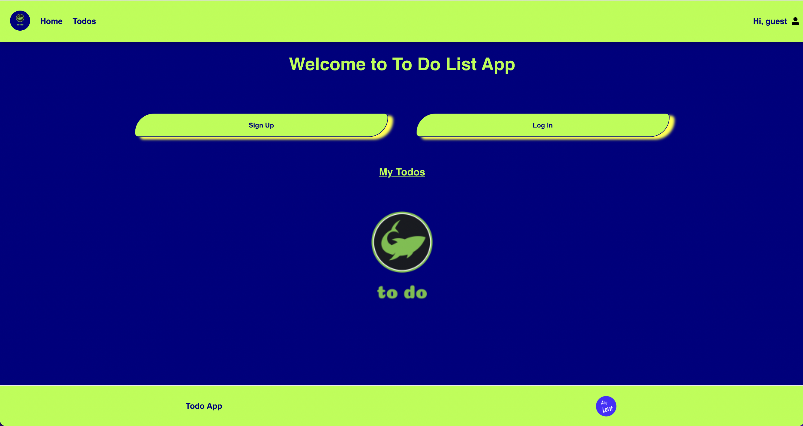
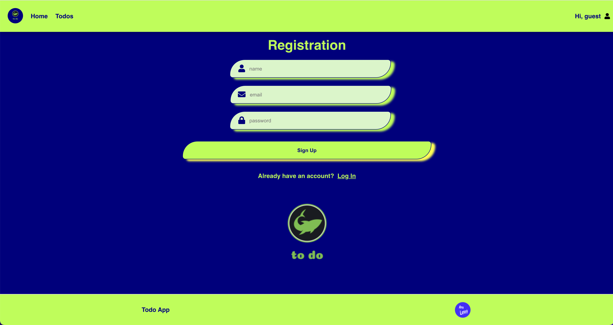
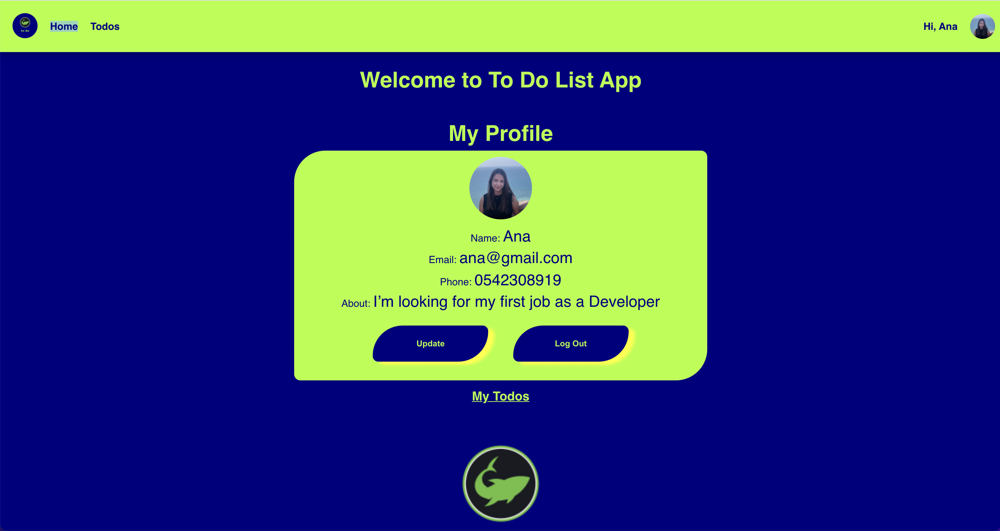
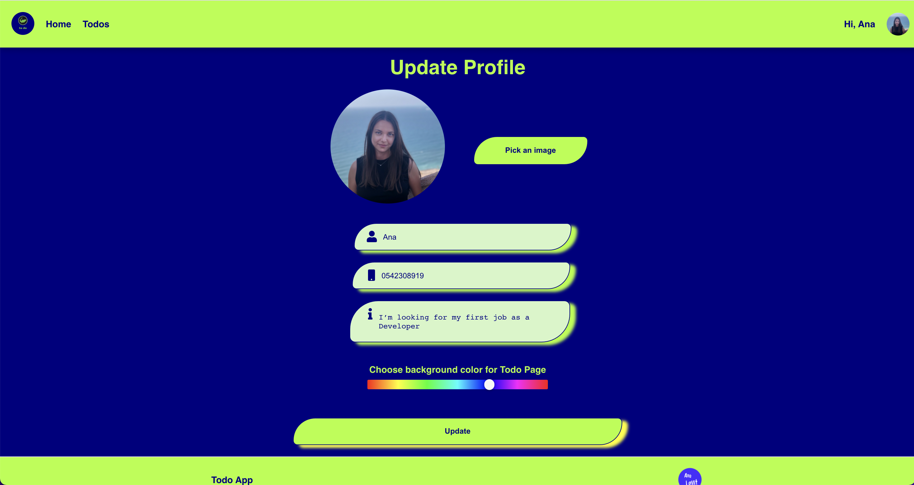
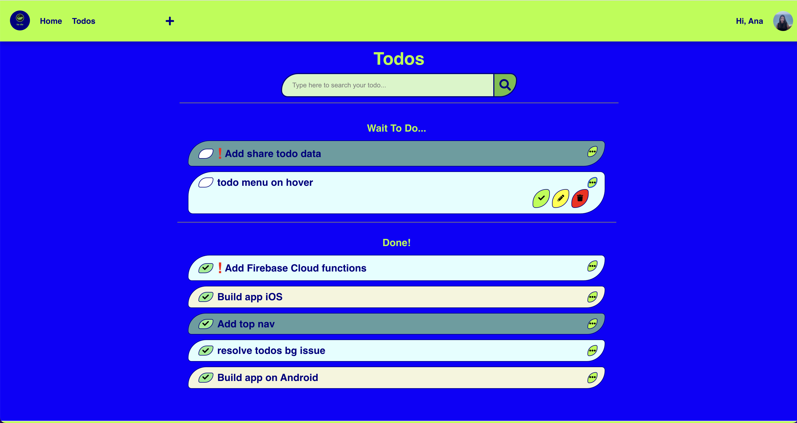
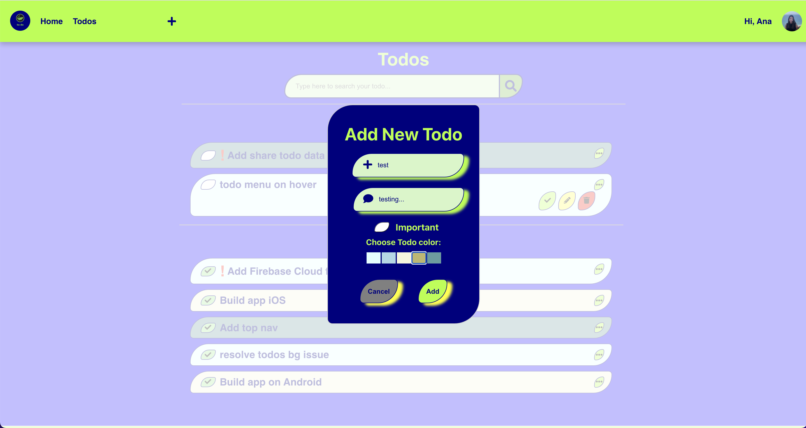

# Todo App  
Todo App using TypeScript, React, Redux and Firebase services.   

ToDo Cross-Platform App - explanation on Youtube - https://www.youtube.com/watch?v=5IBjLLmK5IA  
Deploy - https://anaalamed-todo-mobile.web.app     
Mobile App - https://github.com/anaalamed/todo-mobile

Some Screenshots:  

    <!--  -->
      
      <!--  -->
      
      
      

